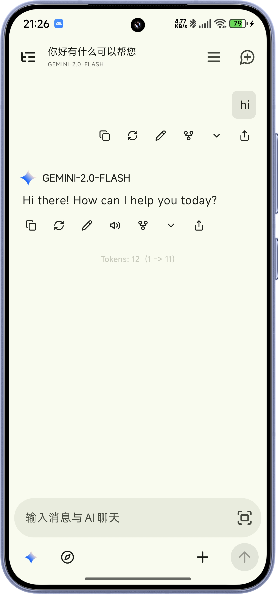

<div align="center">
  
  <h1>RikkaHub Agents</h1>
  <p><strong>A full-featured Agent client for Android</strong></p>
  <p>Device automation · Remote terminal · Multi-model chat · Tool execution</p>

[简体中文](README.md) | [English](README_EN.md)

[](https://github.com/xiwangone/rikkahub-agents/actions/workflows/build-apk.yml)
[](https://github.com/xiwangone/rikkahub-agents/actions/workflows/merge-upstream.yml)
[](https://github.com/xiwangone/rikkahub-agents/releases)
[](LICENSE)

</div>

<div align="center">
  
  
</div>

## Download

- [Releases](https://github.com/xiwangone/rikkahub-agents/releases): stable packages
- [Actions](https://github.com/xiwangone/rikkahub-agents/actions): APK artifacts from successful runs

> [!WARNING]
> This repository is an independently maintained fork. Verify source, signature, and permissions before installing. Report fork-specific issues here.

## Capabilities

| Capability | Description |
|:--|:--|
| Agent mode | Continuous tool execution for complex tasks |
| Device tools | SSH, terminal, files, apps, and Android automation |
| Multi-model access | OpenAI, Google, Anthropic-compatible APIs, and custom services |
| Workspace | Isolated proot Linux environment and command execution |
| Multimodal input | Images, documents, PDFs, and content processing |
| Integrations | MCP, search, web access, and Telegram Bot |
| Automated maintenance | Scheduled source sync and on-demand signed APK builds |

## Build

```bash
git clone --recurse-submodules https://github.com/xiwangone/rikkahub-agents.git
cd rikkahub-agents
./gradlew assembleDebug
```

> [!TIP]
> Place `google-services.json` under `app/` before building.  
> The `web` module requires **pnpm** to build `web-ui/`.

## CI and signing

- `.github/workflows/` is tracked by Git and is included in clones and forks.
- GitHub Secrets are not part of the repository and are never cloned or forked.
- Release builds use a stable signing key, allowing later APKs signed by the same key to overwrite-install.
- Manual build: Actions → **编译 APK · Build APK** → Run workflow.

## Structure

```text
├── app/                    # Android application
├── ai/                     # Model and message abstractions
├── workspace/              # Agent workspace and device tools
├── web/                    # Embedded web service
├── web-ui/                 # Web frontend
├── .github/workflows/      # Maintenance and builds
└── docs/                   # Icons and screenshots
```

## Feedback and contributions

- Report fork-specific problems in this repository's [Issues](https://github.com/xiwangone/rikkahub-agents/issues).
- Build or test the affected modules before submitting changes, and keep unrelated refactors separate.

## Origin and license

This repository was forked from [ExTV/rikkahub-agent](https://github.com/ExTV/rikkahub-agent), which is based on [RikkaHub](https://github.com/rikkahub/rikkahub). Licensed under the [GNU AGPL v3.0](LICENSE).
